# 基于springboot的夕阳红公寓管理系统

<h4 style='color:red'>联系不到我，就看我的主页 </h4> 
 
#### 介绍

随着老龄化社会的到来，夕阳红公寓的需求日益增长。为了提供更优质、高效的服务和管理，我们开发了基于 Spring Boot 的夕阳红公寓管理系统。该系统旨在为管理员和用户（公寓的租客或家属）提供便捷、实用的功能，提升公寓的管理水平和居住体验。

#### 技术栈

后端技术栈：Springboot+Mysql+Maven

前端技术栈：Vue+Html+Css+Javascript+ElementUI

开发工具：Idea+Vscode+Navicate

#### 系统功能介绍

（一）管理员角色  
个人中心：管理员可在此查看和修改个人信息，接收系统通知和重要消息。  
基础数据管理：维护公寓的基础信息，如房间类型、设施配备、服务项目等，为其他管理功能提供数据支持。  
访客管理：记录访客的信息，包括姓名、来访时间、拜访对象等，确保公寓的安全和秩序。  
公告信息管理：发布公寓的通知、活动安排、规章制度等公告信息，让用户及时了解公寓的动态。  
缴费管理：处理租客的费用缴纳情况，包括租金、水电费、服务费等，生成缴费账单并进行催缴。  
留言管理：查看和回复用户的留言，及时解决用户的问题和需求，提高服务质量。  
维修管理：接收和处理用户的维修申请，安排维修人员进行维修，并跟踪维修进度和结果。  
行程轨迹管理：了解公寓内老人的行程轨迹，保障他们的安全，特别是在特殊情况下能够快速定位和采取措施。  
租客管理：管理租客的基本信息、入住情况、合同信息等，进行租客的登记、续租、退租等操作。  
轮播图信息：设置公寓首页的轮播图，展示公寓的环境、活动、服务等亮点，提升公寓的形象。  

（二）用户角色  
个人中心：用户可以修改个人资料，查看自己的缴费记录、维修申请记录、留言回复等。  
公告信息：及时获取公寓发布的各类公告，了解公寓的最新动态和相关规定。  
留言：向管理员提出问题、建议或需求。  
后台管理  
公告信息管理：查看历史公告，确保不错过重要信息。  
缴费管理：查看缴费明细和账单，进行在线缴费。  
留言管理：查看自己的留言和管理员的回复。  
维修管理：提交维修申请，跟踪维修进度。  
行程轨迹管理：了解特定老人（如自己的亲属）的行程轨迹。  
轮播图信息：了解公寓的最新活动和服务展示。  

#### 系统作用

夕阳红公寓管理系统的主要作用包括：

提升管理效率： 为管理员提供全面的公寓管理工具，涵盖基础数据、访客、公告、缴费、留言、维修、行程轨迹和租客等方面。  
优化用户体验： 用户可以方便地查看公告信息、提交留言和维修请求、管理个人信息和缴费等，享受便捷的公寓生活服务。  
信息传递： 通过公告信息和轮播图管理，管理员可以及时向用户传递最新的公寓信息和通知。  
安全保障： 通过访客管理和行程轨迹管理，增强公寓的安全性，确保租客的安全。  

#### 系统功能截图

代码结构

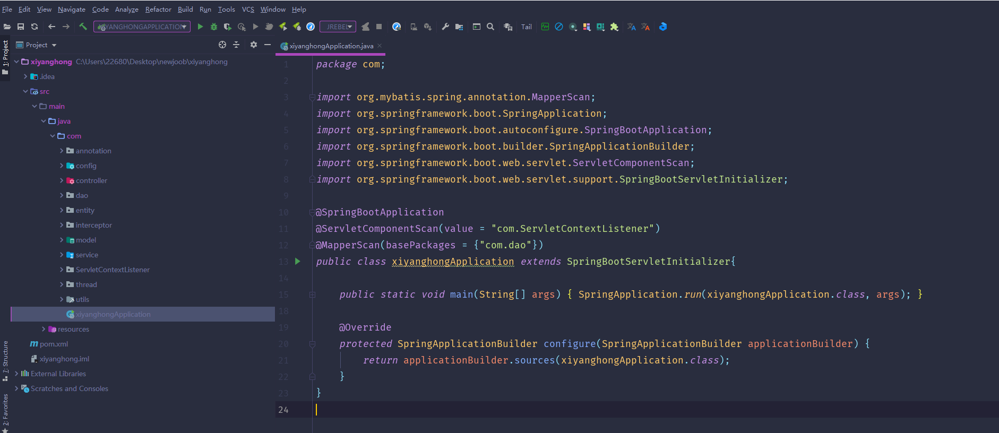

数据库表

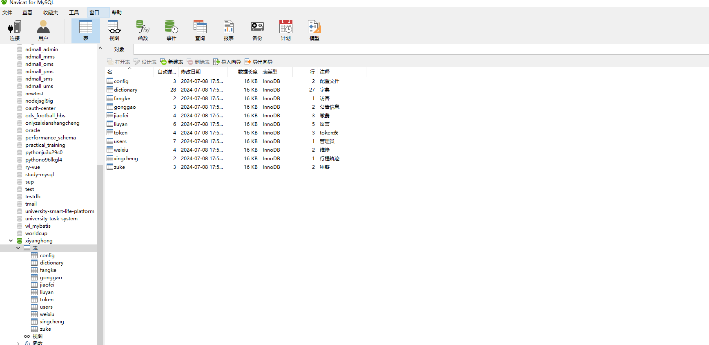

登录

前台页面首页

公告信息

留言

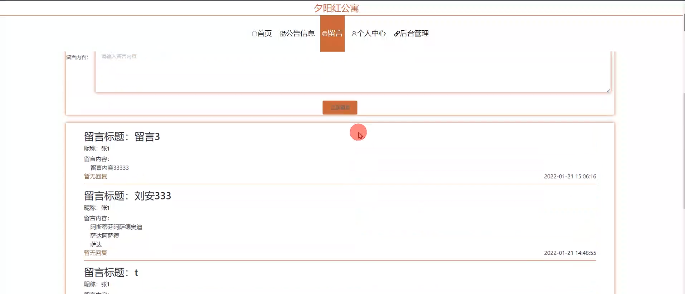

个人中心

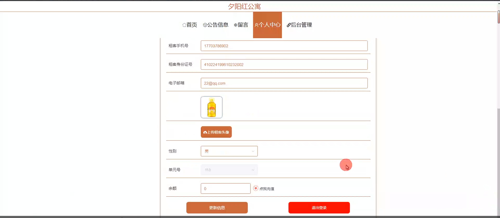

管理员端基础数据管理

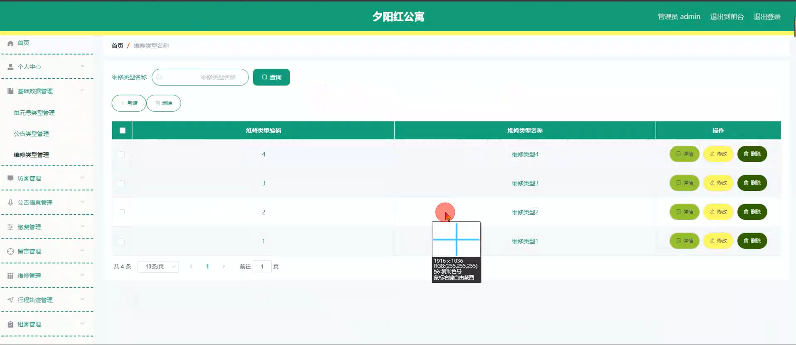

访客管理

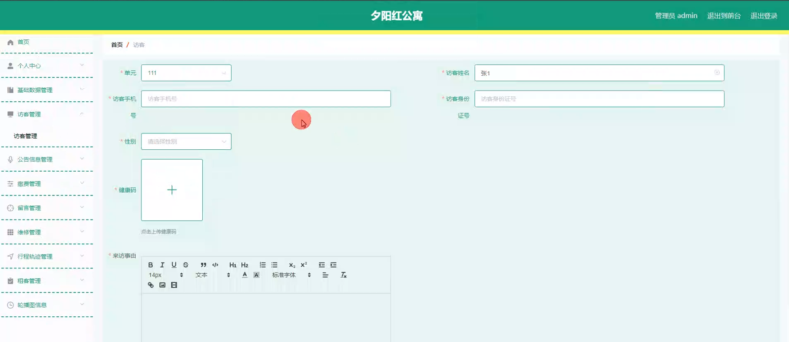

公告信息管理

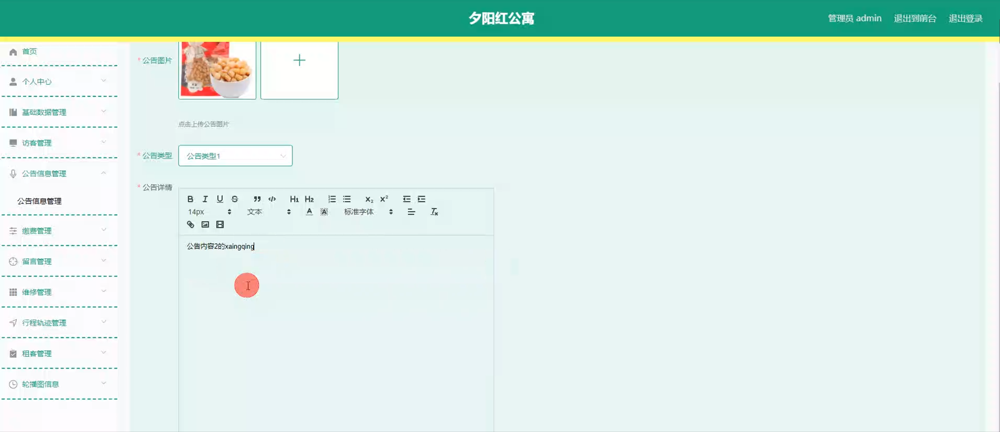

缴费管理

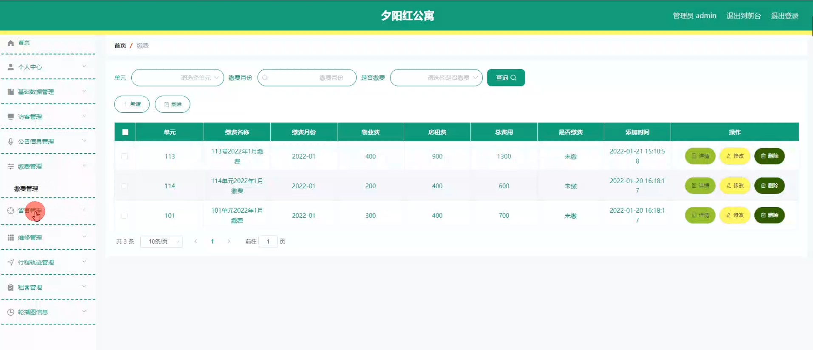

租客管理

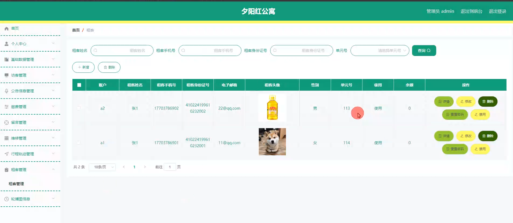

维修管理

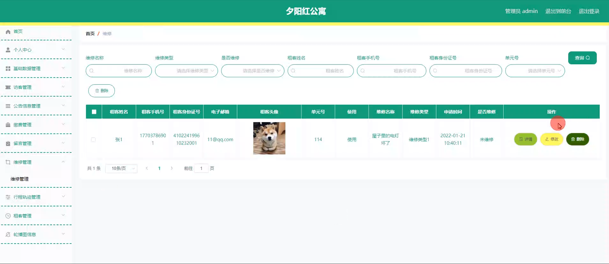

租客端缴费管理

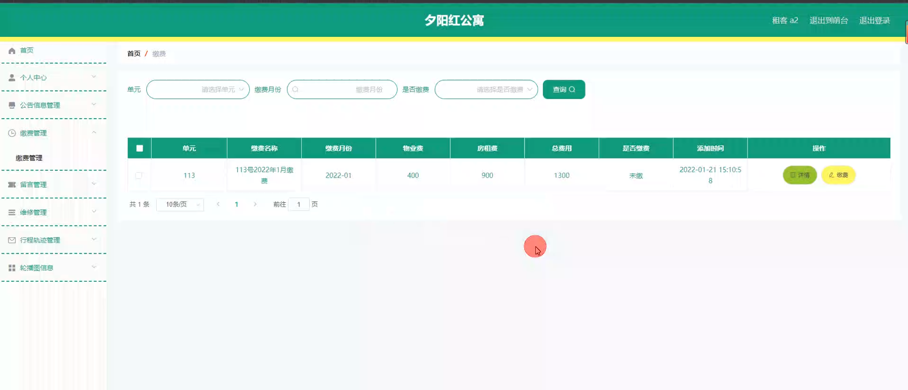

行程轨迹管理

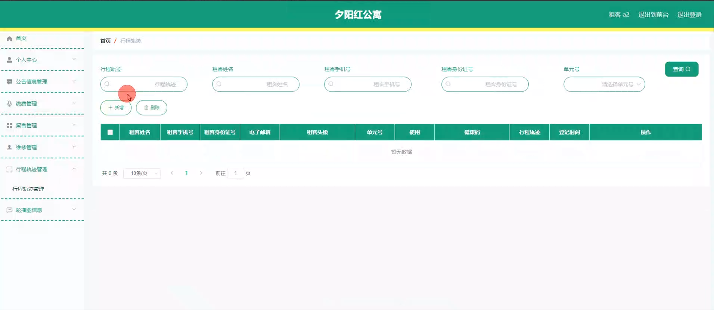

#### 总结

基于 Spring Boot 的夕阳红公寓管理系统通过明确的角色分工和丰富的功能模块，实现了对公寓的全面、高效管理。管理员能够更好地服务租客，租客也能更便捷地参与公寓生活。这一系统有助于提升夕阳红公寓的运营水平，为老年人提供一个舒适、安全、温馨的居住环境。未来，我们将不断改进和完善系统，以适应不断变化的需求和发展趋势。

#### 使用说明

创建数据库，执行数据库脚本 修改jdbc数据库连接参数 下载安装maven依赖jar 启动idea中的springboot项目

前台登录页面
http://localhost:8080/xiyanghong/front/index.html

后台登录页面
http://localhost:8080/xiyanghong/admin/dist/index.html

管理员 			账户:admin 	密码：admin
租客 			账户:a1 		密码：admin
租客 			账户:a2 		密码：admin
